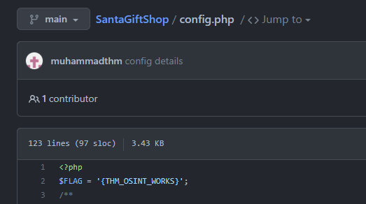

# 🎄 Advent of Cyber 4 (2022)


[https://tryhackme.com/room/adventofcyber4](https://tryhackme.com/room/adventofcyber4)


| Room Attributes       | Value                                                                   |
| --------------------- | ----------------------------------------------------------------------- |
| Subscription Required |  <mark style="color:green;background-color:green;">False</mark> \[Free] |
| Type                  | Walkthroughs                                                            |
| Difficulty            |  <mark style="color:green;background-color:green;">Easy</mark>          |
| Tags                  | beginner, christmas, challenge, advent                                  |

## Task 6 \[Day 1] Frameworks Someone's coming to town!

<figure><figcaption></figcaption></figure>

Your task is to help the Elves solve a puzzle left for them to identify who is trying to stop Christmas. Click the View Site button at the top of the task to launch the static site in split view. You may have to open the static site on a new window and zoom in for a clearer view of the puzzle pieces.

Puzzle  Solutions

Puzzle 1/3

.png>)

Puzzle 2/3

Puzzle 3/3

.png>)

Once you complete the puzzles you'll be presented with defaced site containing the flag and a calling card from the malicious actor:

.png>)

### Who is the adversary that attacked Santa's network this year?

Reveal Flag 🚩

:triangular\_flag\_on\_post:`The Bandit Yeti`

### What's the flag that they left behind?

Reveal Flag 🚩

:triangular\_flag\_on\_post:`THM{IT'S A Y3T1 CHR1$TMA$}`

### Looking to learn more? Check out the rooms on [Unified Kill Chain](https://tryhackme.com/room/unifiedkillchain), [Cyber Kill Chain](https://tryhackme.com/room/cyberkillchainzmt), [MITRE](https://tryhackme.com/room/mitre), or the whole [Cyber Defence Frameworks](https://tryhackme.com/module/cyber-defence-frameworks) module!


No answer needed


## Task 7 \[Day 2] Log Analysis Santa's Naughty & Nice Log!

<figure><figcaption></figcaption></figure>

### Ensure you are connected to the deployable machine in this task.


No answer needed


### Use the `ls` command to list the files present in the current directory. How many log files are present?

Reveal Flag 🚩

:triangular\_flag\_on\_post:`2`

### Elf McSkidy managed to capture the logs generated by the web server. What is the name of this log file?

Reveal Flag 🚩

:triangular\_flag\_on\_post:`webserver.log`

### Begin investigating the log file from question #3 to answer the following questions.


No answer needed


### On what day was Santa's naughty and nice list stolen?

Reveal Flag 🚩

:triangular\_flag\_on\_post:`Friday`

### What is the IP address of the attacker?

Reveal Flag 🚩

:triangular\_flag\_on\_post:`10.10.249.191`

### What is the name of the important list that the attacker stole from Santa?

Reveal Flag 🚩

:triangular\_flag\_on\_post:`santaslist.txt`

### Look through the log files for the flag. The format of the flag is: THM{}

Reveal Flag 🚩

:triangular\_flag\_on\_post:`THM{STOLENSANTASLIST}`

### Interested in log analysis? We recommend the [Windows Event Logs](https://tryhackme.com/room/windowseventlogs) room or the [Endpoint Security Monitoring Module](https://tryhackme.com/module/endpoint-security-monitoring).&#x20;


No answer needed


\

